# loop locate
An accessory developed for [loop earplugs](https://www.loopearplugs.com).
>This project is a personal hobby project and doesn't relate to any company or person.

## Story
I applied for a job position at loop earplugs and received valuable feedback—I was described as having a ***'Swiss army knife'*** type profile, while they were looking for a more focused senior type. Despite the rejection, my love for the company and its products drove me to spend many hours searching for an improvement opportunity. When I identified one, I took the initiative to create a solution, developing a fully functional prototype to showcase my skills and determination.

While the outcome of my job application remains uncertain, the experience allowed me to connect with great people within the 'loop' network, making it entirely worthwhile.

The project took a sweet turn for me, prompting me to share it here.

## The problem
Many Loop users don't use it daily; they reserve it for cinemas, concerts, and noisy nights. Carrying the loop everywhere becomes impractical, and its small size increases the chances of forgetting where it was last placed. This realization sparked the idea for a new accessory—***loop locate***. It is a carry case that can be called by its mobile application, emitting a sound to help locate it. The timeline and the steps taken to prepare the prototype are detailed [here](#timeline-2024).

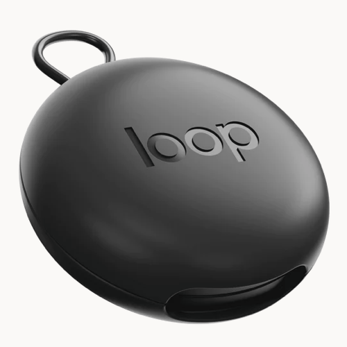  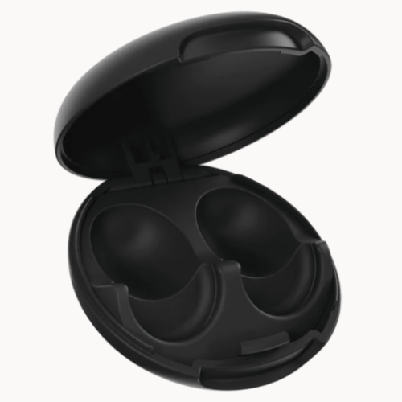  

>The Loop Locate case utilizes all parts of the current carry case, excluding the bottom part. It is designed to be 6.5mm deeper to accommodate the necessary electronics. Keep in mind that this depth is optimized for prototyping, and the final product design will be thinner. A prototype image will be added once it is ready.

## How does it work?
1. Install the “loop locate” application from the Apple App Store.

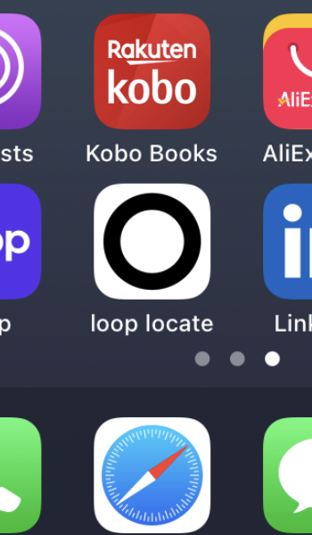  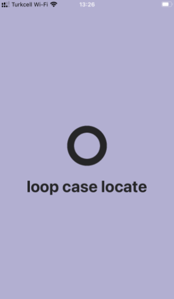  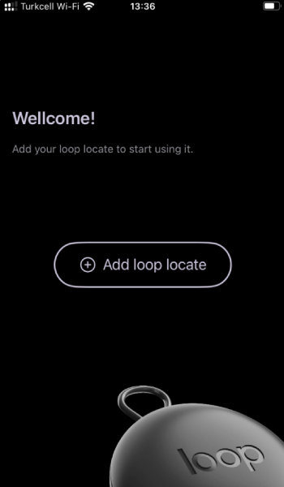

2. Tap the add button in the application and follow the instructions.

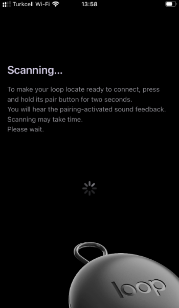

3. From now on, you can call your loop locate and it will emit a sound to help you locate it.

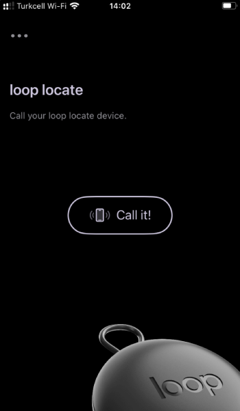    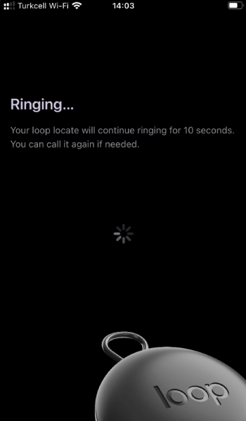

## Project Description 
This repository contains:
 * 3D model of the modified bottom part of the loop case
   * STL file: To make a 3D print and have one
   * SLDPRT file: Editable SolidWorks 3D design
 * Electronics
   * Gerber files: For easy PCB ordering
   * PcbDoc: Altium designer editable PCB file
   * BOM: Bill of materials
 * iOS application
   * Swift source code for the iOS application

## Timeline (2024)
>February 5th - Idea

I started to write down the idea and made decisions about how to make a fast but fully functional prototype. Communication, software languages, component selection and so on. I decided to develop an iOS application and design a board with the size of the current loop carry case for the prototype. 

>February 6th - Order

Since there was no detailed documentation or dimensions of the loop cases, I ordered two [loop earplugs - Quiet](https://www.loopearplugs.com/products/quiet) to measure the dimensions from.

>February 7th - Electronics

Power consumption was the most important and challenging part of this idea. I can’t expect the user to charge the loop locate every day.  
I started to work with an ESP32-C3. For prototyping it was the reachable choice that I had. I planned to put the device into deep sleep mode and wake it up by its RTC once every 60 seconds to extend the battery life time. In deep sleep mode I reached 7-10uA (depending on temperature) and that was good enough for this prototype.  
After the RTC wakes up the SoC, it begins scanning for its uniquely dedicated BLE service UUID for 10 seconds. If it is found, it indicates an incoming call, and the device starts ringing.  
I had two choices for scanning:  
 * Active scan that uses more power but could makes it connect faster
 * Passive scan is more battery-friendly but takes more time to connect

Here is the result of power consumption in the scanning period. A 2Ω resistor in series with the power line used to monitor the current consumption.

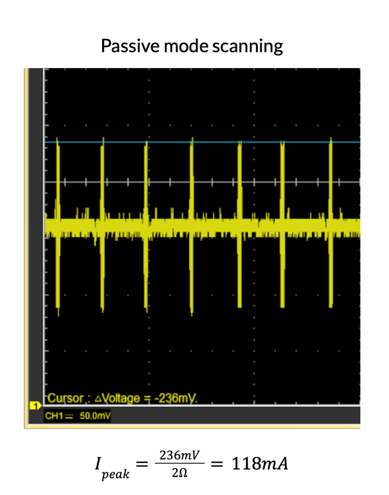  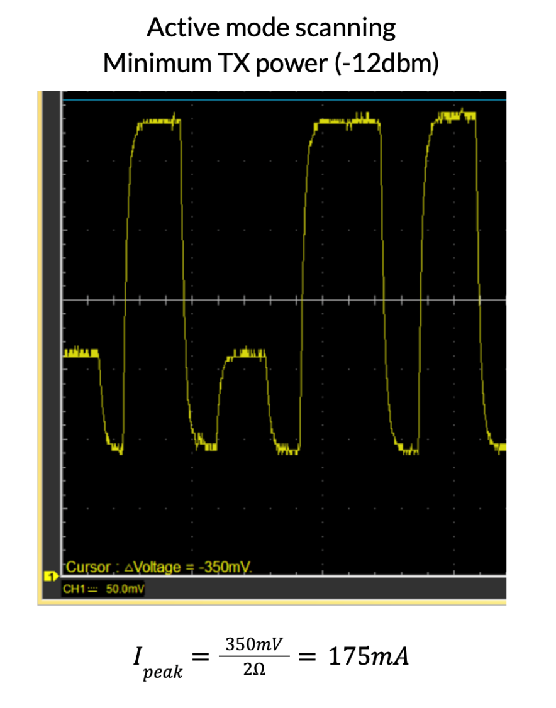  
Waveforms had been captured using my Hantek oscilloscope  
The BLE communication tests have been done with Nordic Semiconductor’s [nRF Connect](https://play.google.com/store/apps/details?id=no.nordicsemi.android.mcp&pcampaignid=web_share) application

Since there was no noticeable delay in passive mode scanning I used it to keep the device’s battery longer lasting.  
Depending on usage statistics, the battery charge in this prototype should last for more than a month. The final product will be able to achieve even greater longevity on a single charge, thanks to the use of SoCs with lower power consumption and better batteries.

I ordered some buzzers to test their sound before ordering the PCB.  
Also a 120mAh LiPo battery was my choice. Although a round Li-po battery was much better for 3D design and could make its bottom more curvy, it wasn’t easily available in the Turkish market. But this one was a good fit too and it was available. 

>February 8th - Firmware

To speed up the process, I started to write the firmware on a ESP32-C3-DevKitM-1 I already had using Arduino.
The logs are available on the UART with 115200 bps.  

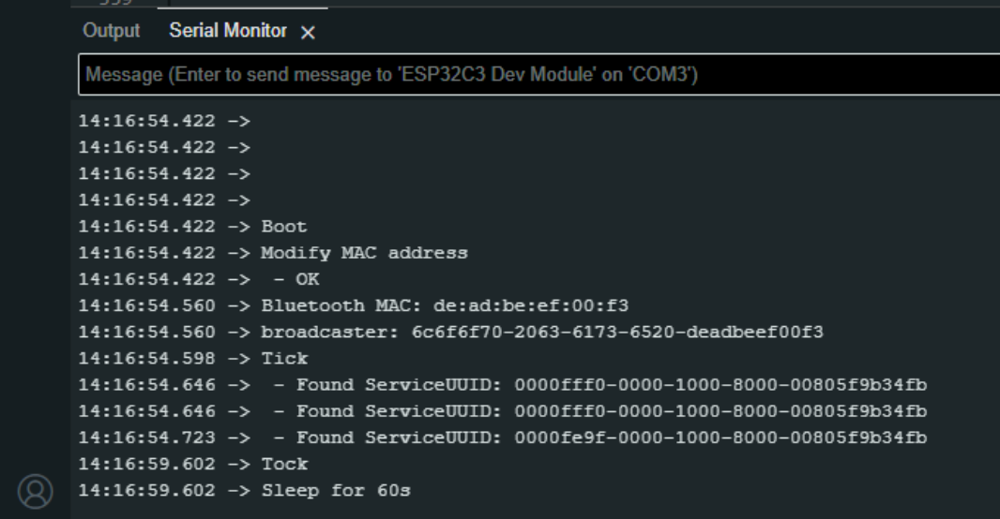  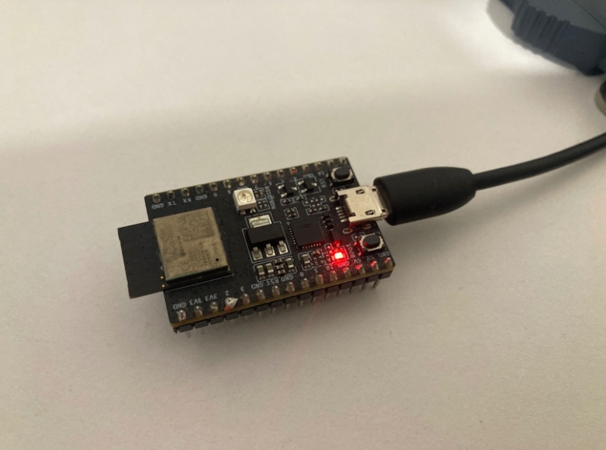  

>February 9th - iOS application functionality

I started to develop the prototype application in SWIFT with the simplest possible UI and writing BLE functions, communicating with the DevKit and managing timeouts, errors and troubleshooting.

>February 10th - iOS application UI

I finalized the iOS application and did a little UI improvement.

>February 11th - Apple App Store

I submitted the required images and documents to publish the prototype's application on the App Store. A few days later, I received an email stating that, to approve the application, I should record a video demonstrating the working product using the application. They didn't accept footage with the DevKit, so the process was paused until I completed the prototype.

>February 12th - PCB

I got my Black loop Quiet and the quality was unbelievably great. However the case was white, not black!  
I ordered the black one due to the 3D print shop I work with, which only prints SLS models in black.  
To proceed with measuring the dimensions for PCB and 3D design, I had to take the case apart.  

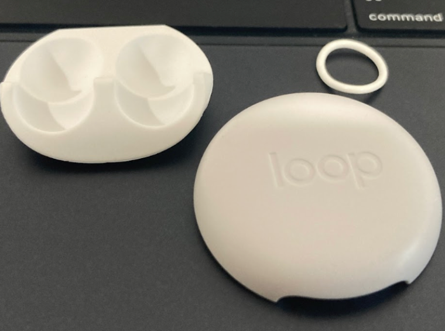  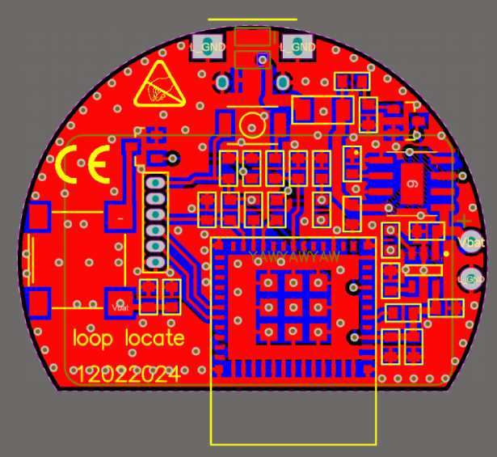  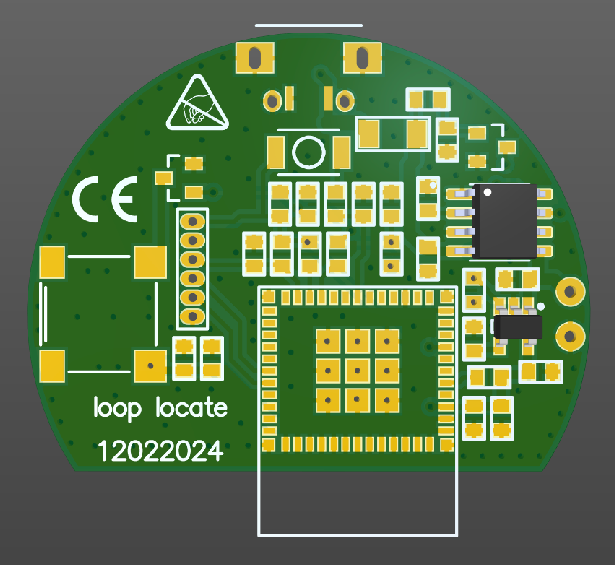  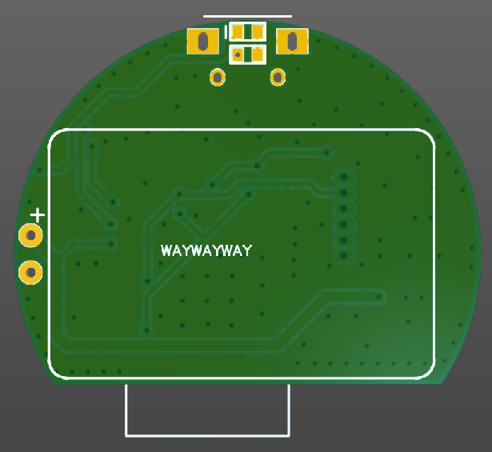  
Note the PCB thickness should be 0.8mm to fit the 3D design.  

I submitted an order on PCBWay, but due to the Chinese New Year holidays, it will take longer than usual to receive the PCB.

>February 13th - 3D design

I wish I had the rounded battery, it would make me able to increase the curving radius of the bottom and make it much more beautiful. But this was the fastest way to achieve the working prototype for me.  
I had to make some modifications to the original part:
 * Adding 6.5mm to the height 
   * 3mm for battery
   * 0.8mm for PCB
   * 2.7mm for the tallest component on the PCB
 * Three holes for sound
 * Charging port opening 
 * Stands for PCB

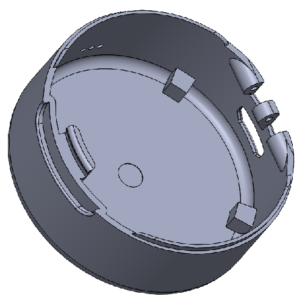

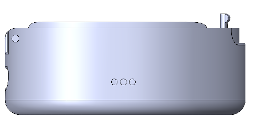  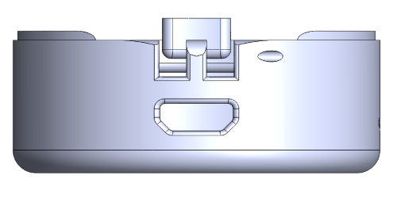  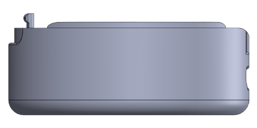  

I designed it in SolidWorks and I ordered the SLS 3D print. 

>February 21th - 3D printed body

I got the 3D printed part of body today.

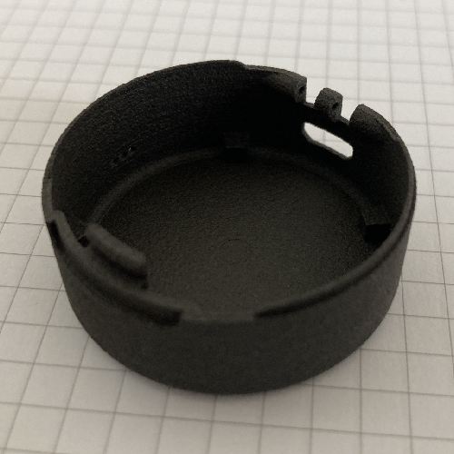  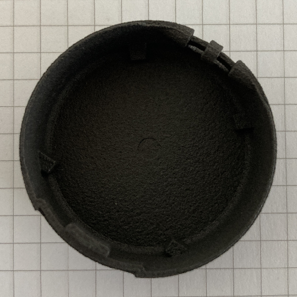  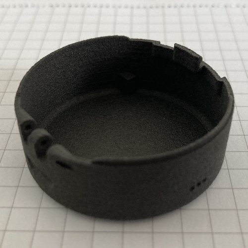  
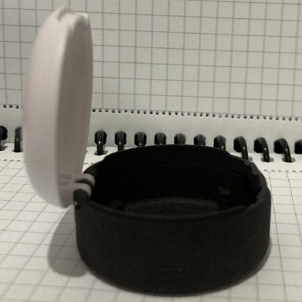  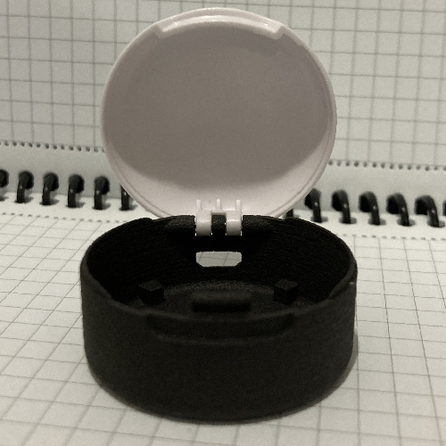  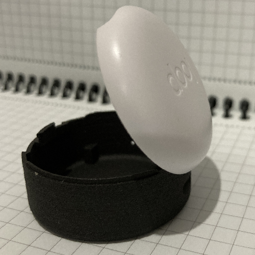  

>February 22th - 3D design

The difference in curve radius between the top and bottom parts and also the colors doesn't look good together. Since I'm still waiting for the PCB, I have time to order another 3D-printed part, so I've designed the top side too.

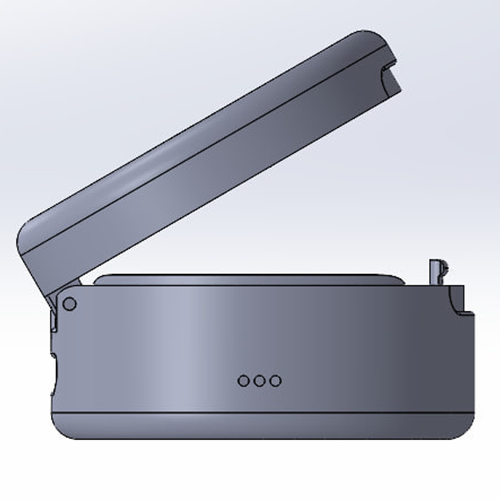  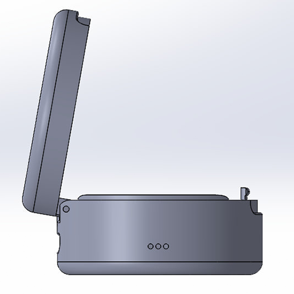  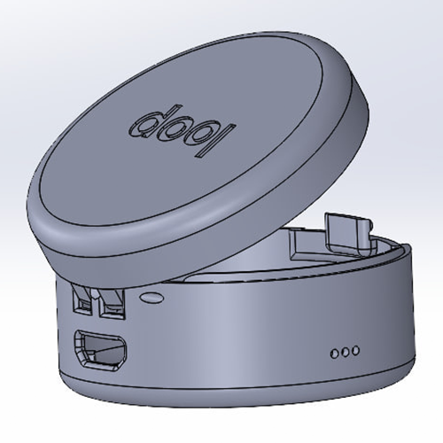  

>February 27th - Assembling

I got both the 3D printed parts and PCB today and started to putting them together.

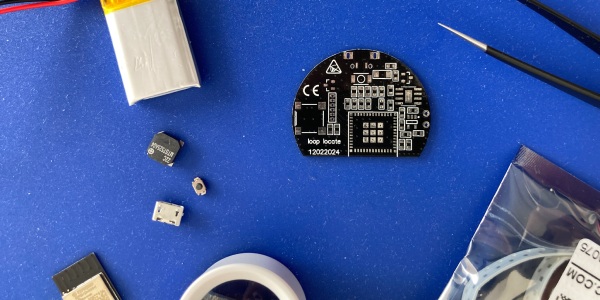 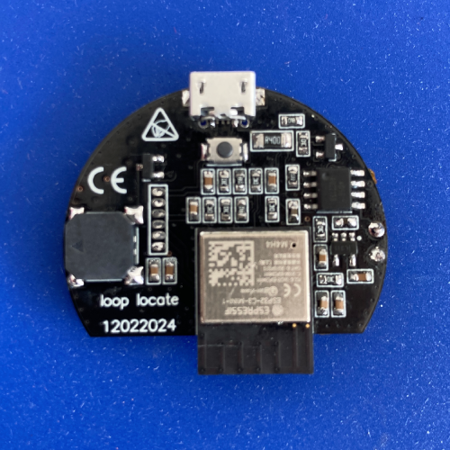 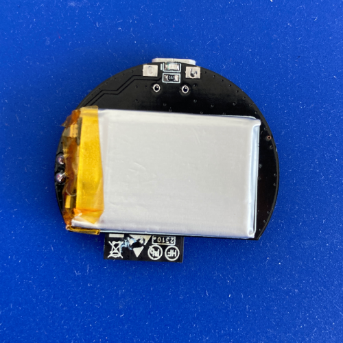 

 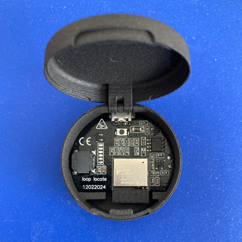 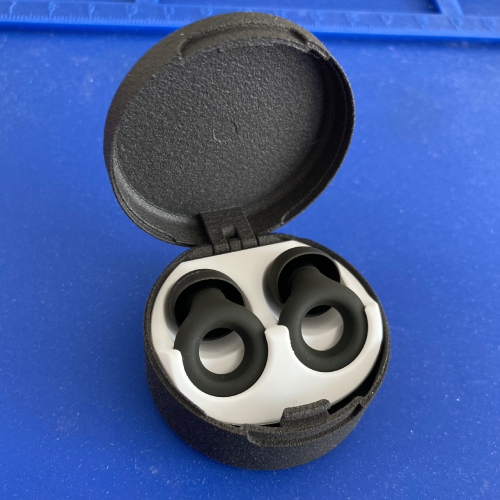 

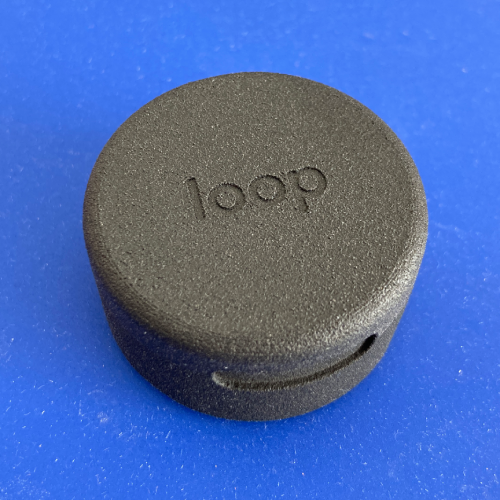 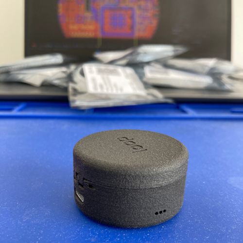 

Everything worked well and was ready to record the video for apple app store.
[Here](https://drive.google.com/file/d/1b1V_XANwa1eLE-llirHkk3rfKeZi7E60/view?usp=share_link) is the simple video that I sent to apple, hope they accept it and publish the application.

>***Current Status: Awaiting the Application approval.***
